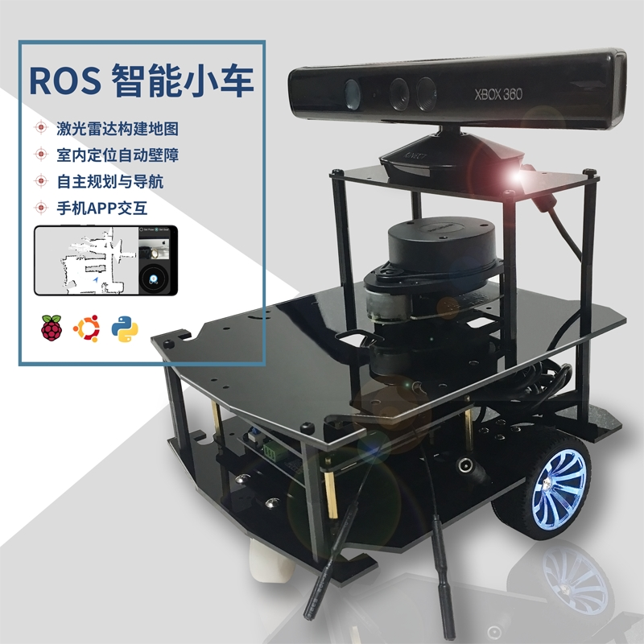

Mobile robots use two core technologies: SLAM (Simultaneous Localization and Mapping) and path planning. Computer vision has advanced rapidly in recent years, with significant achievements in a variety of fields. Laser SLAM has attracted the attention of a growing number of researchers due to its application in the field of robotics. There are still a lot of issues with visual mapping and obstacle avoidance in mobile robots today. As a result, this topic aims to investigate mobile robot laser SLAM and dynamic obstacle avoidance technology, as well as develop a mobile robot capable of autonomous navigation and obstacle avoidance. Monocular depth estimation (MDE), on the other hand, predicts pixel-level depth from a single image and is critical in image sensing. Because of the use of deep neural networks, MDE has come a long way (DNNs). However, due to their high computational complexity, current MDE methods are often slow for inference on embedded devices. As a result, this topic also i nvestigates and discusses the deployment and application of the monocular depth estimation model in embedded devices, and finally realizes the laser SLAM obstacle avoidance and monocular depth estimation obstacle avoidance of mobile robots, based on the application effect in the real world. This topic is very useful for research on autonomous navigation and obstacle avoidance of mobile robots because it compares and analyzes the advantages and disadvantages of the two methods.

